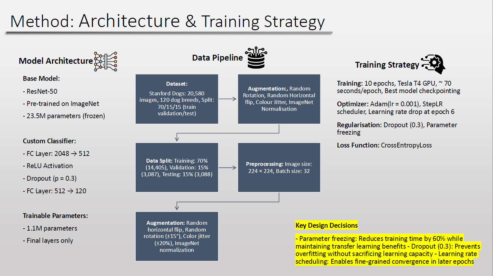
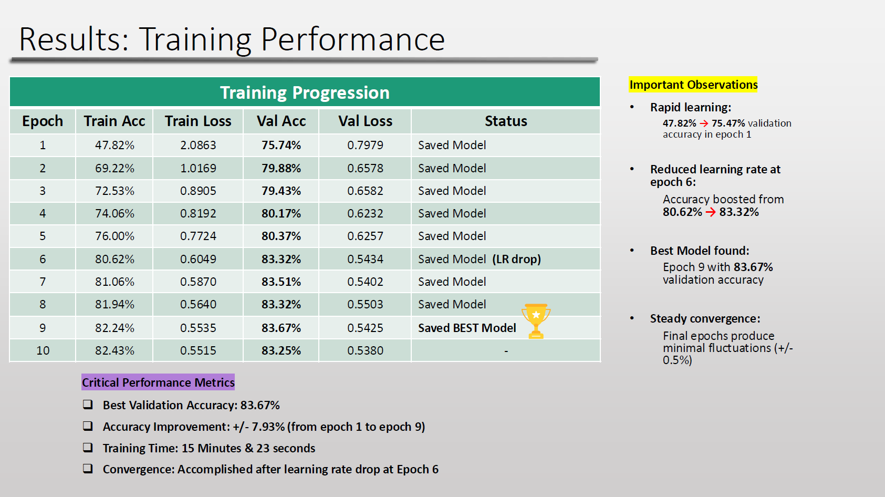
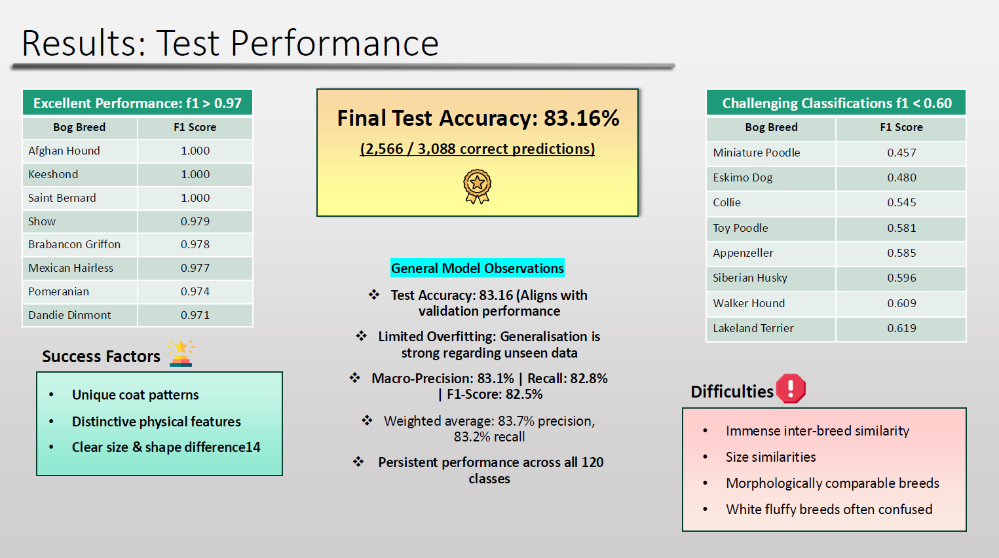
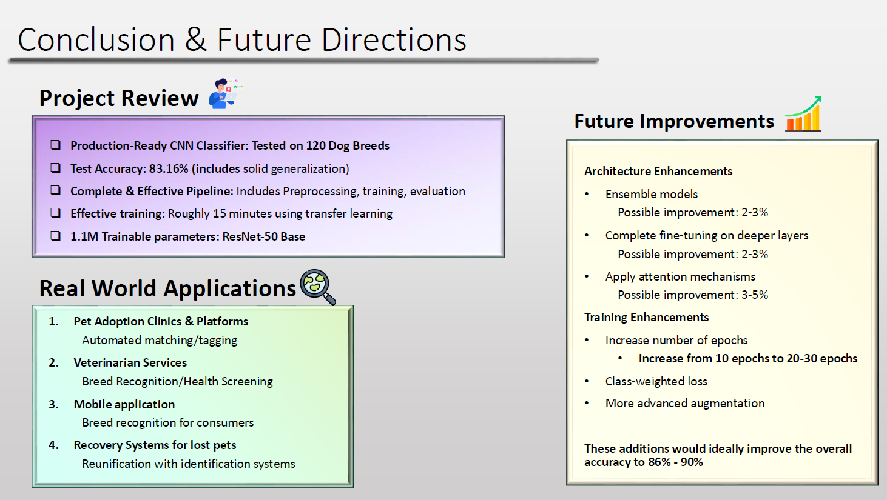

# Dog Breed Classification CNN

A deep learning project implementing a Convolutional Neural Network for classifying 120 dog breeds with 83.16% accuracy using transfer learning with ResNet-50.


---

**📚 Quick Links:**
- 🚀 [Getting Started Guide](GETTING_STARTED.md) - 5-minute setup
- ❓ [FAQ](FAQ.md) - Common questions answered
- 📁 [Project Structure](PROJECT_STRUCTURE.md) - File organization explained
- 📊 [View Presentation](Dog_Breed_CNN_Presentation.pdf) - Academic presentation

---

## 📋 Table of Contents
- [Overview](#overview)
- [Quick Start](#quick-start)
- [Features](#features)
- [Architecture](#architecture)
- [Results](#results)
- [Installation](#installation)
- [Usage](#usage)
- [Dataset](#dataset)
- [Training Details](#training-details)
- [Future Improvements](#future-improvements)
- [Real-World Applications](#real-world-applications)
- [Project Presentation](#project-presentation)
- [License](#license)
- [Contact](#contact)

<a id="overview"></a>
## 🎯 Overview

This project addresses the challenging task of fine-grained visual classification of 120 dog breeds from the Stanford Dogs dataset. The model leverages transfer learning with a pre-trained ResNet-50 architecture to achieve production-ready performance with efficient training time.

**Key Achievements:**
- ✅ 83.16% test accuracy on 120-class classification
- ✅ Training time: ~15 minutes on Tesla T4 GPU
- ✅ 1.1M trainable parameters (frozen base model)
- ✅ Comprehensive evaluation with confusion matrices and classification reports

<a id="quick-start"></a>
## ⚡ Quick Start

```bash
# Clone the repository
git clone https://github.com/BenFricker/dog-breed-cnn-classifier.git
cd dog-breed-cnn-classifier

# Install dependencies
pip install -r requirements.txt

# Download dataset (see Dataset section below)
# Update data_dir in Dog-Breed-CNN.py (line 99)

# Train the model
python Dog-Breed-CNN.py
```

**That's it!** The script will train the model, generate visualizations, and save the best model checkpoint.

<a id="features"></a>
## ✨ Features

- **Transfer Learning**: Utilizes pre-trained ResNet-50 (ImageNet weights)
- **Custom Classification Head**: Multi-layer Sequential classifier with dropout regularization
- **Data Augmentation Pipeline**: Random rotation, horizontal flip, and color jittering
- **Model Checkpointing**: Automatic saving of best performing model
- **Comprehensive Metrics**: Classification reports, confusion matrices, training curves
- **Production Ready**: Clean, documented code with proper error handling

<a id="architecture"></a>
## 🏗️ Architecture

<p align="center">
  
</p>
<p align="center"><i>Complete pipeline: Model Architecture → Data Pipeline → Training Strategy</i></p>

### Base Model
- **ResNet-50** (pre-trained on ImageNet)
- 23.5M frozen parameters for feature extraction

### Custom Classifier
```
Linear(2048 → 512)
ReLU Activation
Dropout(p=0.3)
Linear(512 → 120)
```

### Training Configuration
- **Optimizer**: Adam (lr=0.001)
- **Loss Function**: CrossEntropyLoss
- **Scheduler**: StepLR (step_size=5, gamma=0.1)
- **Batch Size**: 32
- **Epochs**: 10
- **Data Split**: 70% Train / 15% Validation / 15% Test

<a id="results"></a>
## 📊 Results

### Performance Metrics
| Metric | Value |
|--------|-------|
| Test Accuracy | 83.16% |
| Best Validation Accuracy | 83.67% (Epoch 9) |
| Macro-Precision | 83.1% |
| Macro-Recall | 82.8% |
| Macro-F1 Score | 82.5% |
| Training Time | 15 minutes 23 seconds |

### Training Progression

<p align="center">
  
</p>

**Key Observations:**
- **Rapid initial learning**: 47.82% → 75.74% validation accuracy in epoch 1
- **Learning rate drop impact**: Accuracy jumped from 80.62% → 83.32% at epoch 6
- **Best model**: Epoch 9 with 83.67% validation accuracy
- **Steady convergence**: Final epochs show minimal fluctuation (±0.5%)

### Detailed Performance Analysis

<p align="center">
  
</p>

**Top Performing Breeds (F1 > 0.97):**
- Afghan Hound, Keeshond, Saint Bernard achieved perfect classification (F1 = 1.000)
- These breeds have distinctive features: unique coat patterns, clear size differences, distinctive physical characteristics

**Challenging Breeds (F1 < 0.60):**
- Poodle varieties (Miniature, Toy) and similar fluffy white breeds
- Difficulty due to: inter-breed similarity, morphological overlap, size similarities

The model shows consistent performance across all 120 classes with minimal overfitting, as test accuracy (83.16%) closely aligns with validation performance (83.67%).

<a id="installation"></a>
## 🚀 Installation

### Prerequisites
- Python 3.8+
- CUDA-capable GPU (recommended)

### Setup
```bash
# Clone the repository
git clone https://github.com/BenFricker/dog-breed-cnn-classifier.git
cd dog-breed-cnn-classifier

# Create virtual environment
python -m venv venv
source venv/bin/activate  # On Windows: venv\Scripts\activate

# Install dependencies
pip install -r requirements.txt
```

<a id="usage"></a>
## 💻 Usage

### Step 1: Download the Dataset

**⚠️ Important:** The dataset is NOT included in this repository due to its size (~750 MB, 20,580 images).

**Option A: Download from Kaggle** (Recommended - Easier)
1. Create a free account at [Kaggle.com](https://www.kaggle.com)
2. Go to [Stanford Dogs Dataset](https://www.kaggle.com/datasets/jessicali9530/stanford-dogs-dataset)
3. Click "Download" button
4. Extract the downloaded ZIP file to a location on your computer

**Option B: Download from Stanford** (Original Source)
1. Visit: http://vision.stanford.edu/aditya86/ImageNetDogs/
2. Download: `Images.tar`
3. Extract to your preferred location

**Expected folder structure after extraction:**
```
your-chosen-location/
└── Images/
    ├── n02085620-Chihuahua/
    ├── n02085782-Japanese_spaniel/
    ├── n02085936-Maltese_dog/
    └── ... (117 more breed folders)
```

### Step 2: Configure the Data Path

Open `Dog-Breed-CNN.py` in any text editor and find line 99:

```python
# BEFORE (line 99):
data_dir = r'C:\Users\benwf\OneDrive\Desktop\UOW\UOW\Foundations of Artificial Intelligence\Assessments\Group Project\images'

# AFTER (update to YOUR path):
data_dir = r'C:/Users/YourName/Downloads/Images'  # Windows
# OR
data_dir = '/Users/YourName/Downloads/Images'      # Mac/Linux
```

**💡 Tip:** Use forward slashes `/` or raw strings `r'...'` to avoid path issues.

### Step 3: Run Training

```bash
python Dog-Breed-CNN.py
```

**What happens during training:**
- ✅ Loads and preprocesses 20,580 images
- ✅ Splits data (70% train, 15% validation, 15% test)
- ✅ Trains for 10 epochs (~70 seconds per epoch on GPU)
- ✅ Saves best model as `best_dog_breed_model.pth`
- ✅ Generates training curves and confusion matrices

### Step 4: View Results

After training completes, you'll find these files in your directory:

| File | Description |
|------|-------------|
| `best_dog_breed_model.pth` | Trained model checkpoint (best validation accuracy) |
| `training_curves.png` | Loss and accuracy plots over epochs |
| `confusion_matrix_part_1.png` | Confusion matrix (classes 0-29) |
| `confusion_matrix_part_2.png` | Confusion matrix (classes 30-59) |
| `confusion_matrix_part_3.png` | Confusion matrix (classes 60-89) |
| `confusion_matrix_part_4.png` | Confusion matrix (classes 90-119) |

**Console output** will show:
- Training/validation accuracy and loss per epoch
- Final test accuracy (~83%)
- Detailed classification report (precision, recall, F1-score per breed)

### Troubleshooting

**Problem:** `FileNotFoundError: [Errno 2] No such file or directory`
- **Solution:** Check that `data_dir` path is correct and points to the `Images` folder

**Problem:** `CUDA out of memory`
- **Solution:** Reduce `batch_size` from 32 to 16 (line 163 in the code)

**Problem:** Training is very slow
- **Solution:** Ensure you have a CUDA-capable GPU. CPU training will take 10-20x longer.

**Problem:** `ModuleNotFoundError: No module named 'torch'`
- **Solution:** Run `pip install -r requirements.txt`

<a id="dataset"></a>
## 📁 Dataset

**Stanford Dogs Dataset**
- Total Images: 20,580
- Classes: 120 dog breeds
- Split:
  - Training: 14,405 images (70%)
  - Validation: 3,087 images (15%)
  - Testing: 3,088 images (15%)

### Data Augmentation
- Resize: 224×224
- Random Horizontal Flip
- Random Rotation: ±15°
- Color Jitter: ±20% brightness/contrast
- ImageNet Normalization

<a id="training-details"></a>
## 🎓 Training Details

### Key Design Decisions

1. **Parameter Freezing**: Reduces training time by 60% while maintaining transfer learning benefits
2. **Dropout (0.3)**: Prevents overfitting without sacrificing learning capacity
3. **Learning Rate Scheduling**: Enables fine-grained convergence in later epochs
4. **Model Checkpointing**: Saves best model based on validation accuracy

### Performance Observations
- Rapid initial learning due to pre-trained features
- Learning rate drop at epoch 6 provided significant boost (80.62% → 83.32%)
- Minimal overfitting - test accuracy closely matches validation
- Consistent performance across all 120 classes

<a id="future-improvements"></a>
## 🔮 Future Improvements

<p align="center">
  
</p>

### Architecture Enhancements
- [ ] Ensemble models (Expected: +2-3%)
- [ ] Fine-tuning deeper layers (Expected: +2-3%)
- [ ] Attention mechanisms (Expected: +3-5%)

### Training Enhancements
- [ ] Increase epochs to 20-30
- [ ] Class-weighted loss for imbalanced breeds
- [ ] Advanced augmentation (Mixup, CutMix)
- [ ] Focal loss for hard examples

**Target Accuracy**: 86-90%

<a id="real-world-applications"></a>
## 🎯 Real-World Applications

1. **Veterinary Services**: Automated breed identification for health screening
2. **Pet Adoption Platforms**: Intelligent breed tagging and matching
3. **Lost Pet Recovery**: Identification systems for reunification
4. **Mobile Applications**: Consumer-facing breed recognition apps

<a id="project-presentation"></a>
## 📖 Project Presentation

A comprehensive presentation covering the project's methodology, results, and analysis is included in this repository:

📄 [View Presentation (PDF)](Dog_Breed_CNN_Presentation.pdf)

The presentation includes:
- Literature review of current approaches
- Detailed architecture and training strategy
- Complete results analysis with visualizations
- Real-world applications and future directions

<a id="project-context"></a>
## 📝 Project Context

This project was developed as part of a Foundations of Artificial Intelligence course. Despite being assigned as a group project, I completed all aspects independently:

- ✅ Data acquisition and preprocessing
- ✅ Model architecture design and implementation
- ✅ Training pipeline and optimization
- ✅ Comprehensive evaluation and visualization
- ✅ 15-minute technical presentation
- ✅ Complete documentation

**Academic Note**: I received 53.5% for this project as I was the only contributing member out of a 6-person team. Non-contributing members received 0% as documented by the course coordinator.

<a id="technical-skills-demonstrated"></a>
## 📚 Technical Skills Demonstrated

- **Deep Learning**: CNN architectures, transfer learning, fine-tuning
- **PyTorch**: Model implementation, training loops, data pipelines
- **Computer Vision**: Image classification, data augmentation
- **Data Science**: Performance metrics, visualization, statistical analysis
- **Software Engineering**: Clean code, documentation, version control
- **Communication**: Technical presentation and reporting

<a id="contributing"></a>
## 🤝 Contributing

While this is an academic project, I welcome feedback and suggestions! Feel free to:
- Open an issue for bugs or questions
- Suggest improvements or optimizations
- Share your results if you use this code

<a id="license"></a>
## 📄 License

This project is licensed under the MIT License - see the [LICENSE](LICENSE) file for details.

<a id="contact"></a>
## 👤 Contact

**Benjamin Fricker**
- GitHub: [@BenFricker](https://github.com/BenFricker)
- LinkedIn: [Connect with me on LinkedIn](https://www.linkedin.com/in/benfricker/)

**Current Focus**: Double Major in Artificial Intelligence & Cybersecurity (Computer Science)

💼 **Open to opportunities** in AI/ML Engineering, Computer Vision, and Cybersecurity roles.

---

<a id="acknowledgments"></a>
## 🙏 Acknowledgments

- Stanford Dogs Dataset creators
- PyTorch and torchvision teams
- ResNet architecture authors (He et al., 2015)

---

⭐ If you find this project useful or interesting, please consider giving it a star!

**Last Updated**: October 2025
